# Vue

## 一、介绍

​	Vue是一套构建用户界面的**渐进式框架**，Vue的核心库只关注 **视图层**，能与 **现代化的工具链**以及各种**类库**结合使用


### 1、安装使用

```html
<script src="https://cdn.jsdelivr.net/npm/vue/dist/vue.js"></script>
```

### 2、声明式渲染

​	Vue的核心是一个允许采用简洁的**模板语法**来**声明式**地将数据渲染进DOM的系统

* Vue是一个对象，element元素选择器，data即model与view交互的数据

```html
<div id="app">
  {{ message }}
</div>
<script>
    var app = new Vue({
  		el: '#app',
  		data: {
  	 	message: 'Hello Vue!'
  		}
	})
</script>
```


### 3、vue.js devtools

​	一个插件，可以在chrome中使用。

​	可以用来调试vue.js应用

​	[插件下载]( https://github.com/KasuganoSora001/device_management/tree/master/src )

​	之后只需在chrome的 更多工具-->扩展程序中添加该插件即可在F12使用


### 4、理解Vue的MVVM

​	MVVM（Model View ViewModel）

​	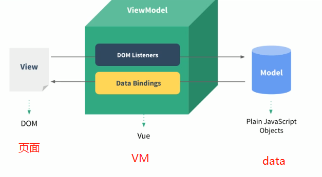

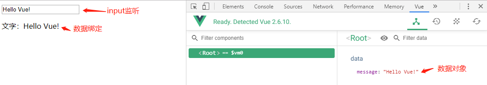


## 二、模板语法

### 1、Mustache语法

```html
<div id="app">
  <p>{{ message }}</p>
  <p>信息：{{ message }}</p>
  <p>{{ firstName + lastName }}</p>
  <p>{{ firstName + ' ' + lastName }}</p>
  <p>{{ firstName}} {{lastName }}</p>
  <p>{{ counter * 2 }}</p>
</div>

<script>
  const app = new Vue({
    el: '#app',
    data: {
      message: 'hello Vue!',
      firstName: 'kobe',
      lastName: 'bryant',
      counter: '100'
    }
  })
</script>
```

**效果：**

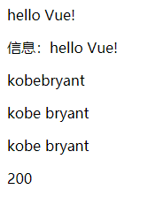


### 2、v-once

```text
该指令表示 元素 和 组件 只渲染一次，DOM不会随着数据的改变而改变
```

```html
<div id="app">
  <p>{{message}}</p>
  <p v-once>{{message}}</p>
</div>

<script>
  const app = new Vue({
    el: '#app',
    data: {
      message: 'hello Vue!'
    }
  })
</script>

```

**效果：**


### 3、v-html

```text
该指令表示DOM从data中获取的数据可以按照 HTML格式 进行解析
```

```html
<div id="app">
  <p>{{msg_Uri}}</p>
  <p v-html="msg_Uri">{{msg_Uri}}</p>
</div>

<script>
  const app = new Vue({
    el: '#app',
    data: {
      msg_Uri: '<a href="http://www.baidu.com">百度</a>'
    }
  })
</script>

```

**效果：**

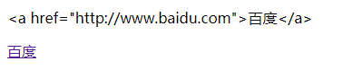


### 4、v-text

```text
该指令表示该元素的内容为指定值，若元素中有内容，则覆盖之
```

```html
<div id="app">
  <p>{{message}},Mr.Liu</p>
  <p v-text="message">,Mr.Liu</p>
</div>

<script>
  const app = new Vue({
    el: '#app',
    data: {
      message: 'hello Vue'
    }
  })
</script>
```

**效果：**

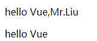


### 5、v-pre

```text
该指令表示该元素的内容不会进行数据的获取
```

```html
<div id="app">
  <p>{{message}}</p>
  <p v-pre>{{message}}</p>
</div>

<script>
  const app = new Vue({
    el: '#app',
    data: {
      message: 'hello Vue'
    }
  })
</script>

```

**效果：**

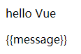


### 6、v-cloak

```text
该指令表示在vue解析之前，div中有一个属性v-cloak，而当vue解析完成之后，v-clock这个属性会被删除

因此可能被用于以下场景：{{message}}获取数据时，由于vue解析过慢或延时，因此用户会先看到{{message}}而非正确的数据。而使用v-cloak就可以对{{message}}进行隐藏，等待vue执行完毕，v-cloak消除，则显示数据
```

```html
<style>
  [v-cloak] {
    display: none;
  }
</style>

<div id="app">
  <p>{{message}}</p>
  <p v-cloak>{{message}}</p>
</div>

<script>
  setTimeout(function (){
    const app = new Vue({
      el: '#app',
      data: {
        message: 'hello Vue'
      }
    })
  }, 1000)
</script>
```


### 7、v-bind

* 前面学习的指令主要都将值插入到我们的 **模板内容** 中
* 但是，除了内容外，若希望某些属性也能动态绑定，则可以用到v-bind:属性名="变量名"
  * 如：a元素的href属性
  * 如：img元素的src属性
* v-bind
  * 作用：动态绑定属性
  * 缩写：:

```html
<div id="app">
  
  <a :href="aHref">百度一下</a>
</div>

<script>
  const app = new Vue({
    el: '#app',
    data: {
      imgUri: 'https://cn.vuejs.org/images/logo.png',
      aHref: 'http://www.baidu.com'
    }
  })
</script>

```

```html

```

* 使用v-bind来控制元素的 **class类型**
* v-bind控制的class类型与元素原来的class类型会进行**叠加**，不会进行覆盖
* 可以使用对象的方式来进行绑定，也就是:class="{}"
* 若结果较为复杂，则可以使用method或computed的方法进行绑定
  * :class="getClasses()"
* 两种语法：**对象语法** 和 **数组语法**
  * 对象语法

```html
<style>
  .active {
    color: red;
  }
  .myFont {
    font-weight: bold;
  }
</style>

<div id="app">
  <!--<h2 :class="{key1: val1, key2: val2}"></h2>-->
  <!--<h2 :class="{类名1: true, 类名2: false}"></h2>-->

  <!--控制class的类型，显示不同的样式-->
  <h2 class="title" :class="{active: isActive, myFont: isFont}">测试字体</h2>
  <h2 class="title" :class="getClasses()">测试字体</h2>

  <!--监控按钮点击事件，点击时修改data属性从而控制h2元素的class类型-->
  <button v-on:click="btnClick">更换颜色</button>

</div>


<script>
  const app = new Vue({
    el: '#app',
    data: {
      isActive: true,
      isFont: false
    },
    methods: {
      btnClick: function(){
        this.isActive = !this.isActive;
      },
      getClasses: function(){
        return {active: this.isActive, myFont: this.isFont};
      }
    }
  })
</script>
```


* 数组语法：

```html
<h2 class="title" :class="[active, font]">测试字体</h2>
<h2 class="title" :class="getClasses()">测试字体</h2>

<script>
  const app = new Vue({
    el: '#app',
    data: {
      active: 'aaaa',
      font: 'bbbb'
    },
    methods: {
      btnClick: function(){
        this.isActive = !this.isActive;
      },
      getClasses: function(){
        return [this.active, this.font];
      }
    }
  })
</script>
```


* 使用v-bind 控制 style 属性：

```html
<div id="app">
  <!--<h2 :style="{key1(样式名): val1(变量值), key2: val2}">测试</h2>-->
  <h2 :style="{fontSize: finalSize + 'px', color: finalColor}">测试</h2>
</div>

<script>
  const app = new Vue({
    el: '#app',
    data: {
      finalSize: 100,
      finalColor: 'red',
    }
  })
</script>

```


### 8、v-for 结合 v-bind 练习

题目：

```text
1、在页面中显示以下条目：['哈利波特', '蜘蛛侠', '钢铁侠', '绿箭侠']
2、添加效果：点击到哪个条目，则改变其颜色为红色
```

```html
<style>
  .active {
    color: red;
  }
</style>

<div id="app">
  <ul>
    <li v-for="(item,index) in movies" v-on:click="liClick(index)" :class="[counter==index?'active':'']">{{index}}-{{item}}</li>
      <li v-for="(item,index) in movies" v-on:click="liClick(index)" :class="{active:counter==index}">{{index}}-{{item}}</li>
  </ul>
</div>

<script>
  const app = new Vue({
    el: '#app',
    data: {
      movies: ['哈利波特', '蜘蛛侠', '钢铁侠', '绿箭侠'],
      counter:-1
    },
    methods: {
      liClick: function(index){
        this.counter = index;
      }
    }
  })
</script>
```


### 9、计算属性

​	基本使用：使用Vue对象中的computed域，编写相应属性方法，使用时只需按平常的属性插值即可

```html
<div id="app">
  <h2>{{firstName + ' ' + lastName}}</h2>
  <h2>{{firstName}} {{lastName}}</h2>
  <h2>{{getFullName()}}</h2>
  <h2>{{fullName}}</h2>
</div>

<script>
  const app = new Vue({
    el: '#app',
    data: {
      firstName: 'kobe',
      lastName: 'bryant'
    },
    // 计算属性：直接当做属性来用即可
    computed: {
      fullName: function(){
        return this.firstName + '-' + this.lastName;
      }
    },
    methods: {
      getFullName: function(){
        return this.firstName + '_' + this.lastName;
      },
    }
  })
</script>
```

​		

​	**复杂使用：**

```html
<div id="app">
  <h2>总价格：{{totalPrice2}}</h2>
</div>

<script>
  const app = new Vue({
    el: '#app',
    data: {
      books: [
        {id: 1, name: '深入理解JVM', price: 100},
        {id: 2, name: 'JaveWeb', price: 110},
        {id: 3, name: '数据结构与算法', price: 120},
        {id: 4, name: '深入理解计算机原理', price: 130}
      ]
    },

    computed: {
        
      totalPrice: function(){
        let result = 0;
        for(let i = 0; i < this.books.length; i++){
          result += this.books[i].price;
        }
        return result;
      },
        
      totalPrice2: function(){
        let result = 0;
        for(let book of this.books){
          result += book.price;
        }
        return result;
      }
        
    },
  })
</script>

```

​	==**计算属性的setter和getter**==

```text
一般来说，计算属性主要是对属性进行一定计算后返回结果，因此一般只需计算一次

在计算属性中可以把成员当做一个个的对象，都有set、get方法

并不希望有人能够对该计算属性进行set操作

一般属性不写set方法，因此为一个只读属性


```

```html
<div id="app">
  <h2>{{fullName}}</h2>
</div>

<script>
  const app = new Vue({
    el: '#app',

    data: {
      firstName: 'kobe',
      lastName: 'bryant'
    },

    computed: {

      // 成员属性的完整写法
      fullName: {
        set: function(newVaule){
          const names = newVaule.split(' ');
          this.firstName = names[0];
          this.lastName = names[1];
        },
        get: function(){
          return this.firstName + ' ' + this.lastName;
        }
      },
      
      // 若属性为只读，可以为以下写法
      fullName2: function(){
        return this.firstName + ' ' + this.lastName;
      }
      
    }
  })
</script>
```


### 10、methods和computed

```text
methods主要是函数的调用
computed主要是对属性的计算并赋值
methods没有缓存，每一次的调用都会重新执行函数
computed有缓存，再次调用时会从缓存中直接取值
在调用computed中的属性时，会先观察该属性的 组成 有没有发生变化，若没有，则直接从缓存中返回结果
```


### 11、事件监听v-on

​	v-on

* 作用：绑定事件监听器
* 缩写：@
* 预期：Function | Inline Statement | Object
* 参数：event


==基础使用：==

```html
<div id="app">
  <p>{{counter}}</p>
  <button v-on:click="increment">+</button>
  <button v-on:click="decrement">-</button>
</div>

<script>
  const app = new Vue({
    el: '#app',
    data: {
      counter: 0
    },
    methods: {
      increment(){
        this.counter++
      },
      decrement(){
        this.counter--
      }
    }
  })
</script>
```


==v-on参数==

```text
情况一：当调用的方法没有参数传递时，方法的()可以省略
情况二：若方法本身有一个参数，但不传递参数，则默认把 事件event 传递过去
情况三：若需要同时传入某个参数，且需要使用 event 时，可以通过 $event 传入事件
```


==v-on修饰符==

① stop修饰符，禁止事件冒泡

```html
  <div @click="divClick">
    aaaaa
    <button @click.stop="btnClick">按钮</button>
  </div>

    methods: {
      divClick() {
        console.log("divClick");
      },
      btnClick() {
        console.log("btnClick");
      }
    }

```


②prevent：禁止默认事件，如表单自动提交

```html
<form action="baidu">
    <input type="submit" @click.prevent="subClick">
</form>
```


③ 

```text
@keyup | @keydown 监听键帽的按下与抬起
@keyup.enter 监听键盘enter键的抬起
@keydown.p   监听键盘p键的按下
```

```html
<input type="text" @keyup.enter="keyup">
```


④ once：只触发一次回调函数

```html
<!-- once：只触发一次回调，可以防止表单重复提交 -->
  <form action="baidu">
    <input type="submit" @click.once="subClick2">
  </form>
```


### 12、条件判断v-if | v-else-if | v-else

==v-if使用==

```html
<div id="app">
  <h2 v-if="isShow">{{message}}</h2>
</div>

<script>
  const app = new Vue({
    el: '#app',
    data: {
      message: 'isShow为true时，显示我',
      isShow: true
    }
  })
</script>
```


==v-else使用==

```html
<div id="app">
  <h2 v-if="isShow">{{msg1}}</h2>
  <h2 v-else>{{msg2}}</h2>
</div>
```


==v-else-if使用==

* 不推荐这样使用

```html
<div id="app">
  <h2 v-if="score>=90">优秀</h2>
  <h2 v-else-if="score>=70">良好</h2>
  <h2 v-else-if="score>=60">及格</h2>
  <h2 v-else>不及格</h2>
</div>

<script>
  const app = new Vue({
    el: '#app',
    data: {
      score: 99
    }
  })
</script>
```

* 可以写成以下形式：使用计算属性s

```html
<div id="app">
  <h2>{{result}}</h2>
</div>

<script>
  const app = new Vue({
    el: '#app',
    data: {
      score: 99
    },
    computed: {
      result() {
        let result_msg = '';
        if(this.score >= 90) {
          result_msg = '优秀';
        } else if(this.score >= 70) {
          result_msg = '良好';
        }
        return result_msg;
      }
    }
  })
</script>
```


### 13、vue底层：virtual dom

```text
vue进行页面渲染时，并不会直接把我们的dom直接显示在浏览器上，而是多了一个中间的处理dom的过程
```

```html
<span v-if="isUserNameLogin">
  <label>用户账号</label>
  <input type="text" placeholder="用户账号">
</span>

<span v-else>
  <label>邮箱账号</label>
  <input type="text" placeholder="邮箱账号">
</span>
```

* 例如渲染以上代码时，label和input进行切换时，在virtual dom中，会**重复利用**这些标签，只不过会改变标签的部分属性，而相似的属性时不会进行改变的
* 这也就导致了一个问题，当用户在input输入信息时，这时进行切换，则virtual dom也会将这个input的信息显示出来

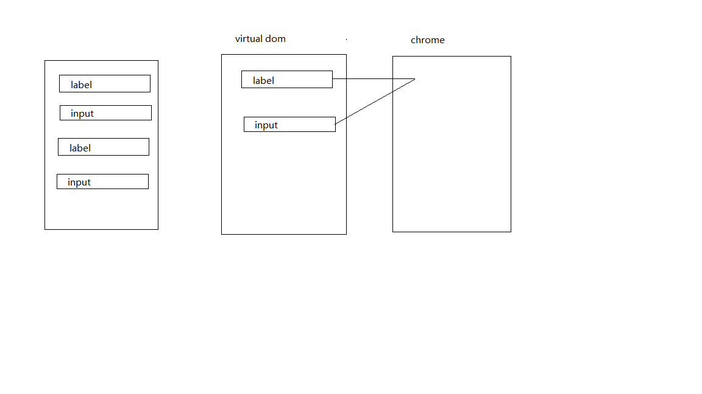

==解决virtual dom进行标签复用的问题==

* 给元素添加一个**key属性**，若前后相同元素中key属性不同，则不会进行标签复用，若相同，则会进行标签复用

```html
<span v-if="isUserNameLogin">
    用户账号：<input type="text" placeholder="用户账号" key="username">
</span>

<span v-else>
    邮箱账号：<input type="text" placeholder="邮箱账号" key="email">
</span>
```


### 14、v-show

v-show展示的效果与v-if相似，但原理却不同

使用 v-if 修饰元素 且 判断条件为false时，元素将不会出现在DOM中

使用 v-show 修饰元素 且 判断条件为false时，元素会被添加上style: display="none"

==使用场景==：

* 当需要在显示与隐藏频繁切换时，推荐使用v-show
* 当切换显示数量较少时，推荐使用v-if


### 15、循环遍历v-for

```html
<div id="app">
  <ul>
    <li v-for="item in names">{{item}}</li>
  </ul>

  <ul>
    <li v-for="(item,index) in names">{{index}}--{{item}}</li>
  </ul>

  <ul>
    <li v-for="value in book">{{value}}</li>
  </ul>

  <ul>
    <li v-for="(value,key) in book">{{key}}--{{value}}</li>
  </ul>

  <ul>
    <li v-for="(value,key,index) in book">{{index}}--{{key}}--{{value}}</li>
  </ul>

</div>

<script>
  const app = new Vue({
    el: '#app',
    data: {
      names: ['james', 'harry', 'curry', 'kobe'],
      book: {
        id: '01',
        name: 'vue',
        price: '100'
      }
    }
  })
</script>
```


==效果：==

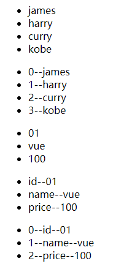


官方推荐在使用v-for时，给元素添加绑定key属性

virtual dom中的diff算法：

* 当在多个li数组中插入新的元素时，如在[A,B,C,D,E]中插入F到B后面
* 则根据diff算法，并不会在B后面添加一个li，而是将C变成F，D变成C，如此类推，直到最后新建一个li标签
* 如此会导致virtual dom的复用性能降低
* 若在li标签中加入key属性，则virtual dom在进行渲染时，会根据key是否对应来进行标签复用，这样就能提高复用性能

```html
<ul>
  <li v-for="(item,index) in names" :key="item">{{index}}--{{item}}</li>
</ul>
```


### 16、filters过滤器

```text
过滤器会将前面的值：getTotalPrice(book)传到showPrice函数中，进行过滤后返回结果
```


```html
<td>{{getTotalPrice(book) | showPrice}}</td>

filters: {
      showPrice(price) {
        return '￥' + price.toFixed(2);
      }
	}
```


### 17、JS高阶函数

==函数式编程==

```html
<script>


  const nums = [1, 20, 44, 110, 55, 200];

  // filter：将数组进行过滤
  // 返回值为true：将当前数组元素添加到新数组中
  // 返回值为false：当前元素不会添加到新数组中
  let newNums = nums.filter(function(n) {
    return (n <= 100);
  })

  // map：将数组中的各个元素进行运算
  // 返回值为运算后的结果，该结果会作为一个新元素添加到新数组中
  let newNums2 = newNums.map(function(n) {
    return n * 2;
  })


  // reduce：对数组进行汇总
  // result：参数previousValue的初始值为reduce函数的第二个参数值，这里也就是0，若不写第二个参数，默认为0
  // 每次返回的结果都会作为下一次遍历的result
  // n：数组元素
  let totalNum = newNums2.reduce(function(result, n) {
    return result + n;
  },0)


</script>
```


==简洁写法：链式编程==

```html
<script>
    const marks = [2, 40, 200, 1000, 500];

      let totalMarks = marks.filter(function(n) {
        return n < 250;
      }).map(function(n) {
        return n * 2;
      }).reduce(function(previousValue, n) {
        return previousValue + n;
      }, 0)
</script>
```


==箭头写法==

```html
<script>
    const counts = [3, 20, 120, 530, 1000];

      let totalCount = counts.filter(n => n < 100)
      						 .map(n => n * 2)
      						 .reduce((preVal, n) => preVal + n);
</script>
```


### 18、表单绑定v-model


#### ①v-model指令实现了**表单**与**数据**的双向绑定

```html
<!--v-model基础使用-->
<div id="app">
  <input type="text" v-model="message">
  <h2>{{message}}</h2>

  <!--使用v-bind和v-on来实现v-model双向绑定-->
  <input type="text" :value="message2" @input="changeMessage">
  <h2>{{message2}}</h2>

</div>


<script>
  const app = new Vue({
    el: '#app',
    data: {
      message: 'hello Vue!',
      message2: 'hello'
    },
    methods: {
      changeMessage(event) {
        this.message2 = event.target.value;
      }
    }
  })
</script>
```

* v-model其实是一个语法糖，本质就是：v-bind绑定value属性，v-on绑定input事件

* ```html
  <input type="text" v-model="message">等同于
  <input type="text" :value="message" @input="message = $event.target.value">
  ```


#### ②v-model 与 radio

```html
<!-- 
  v-model 与 radio 的value双向绑定
  改变data的值可以影响 radio 选项
  使用v-model绑定统一data时，可以不用再写相同的name属性
-->
<div id="app">
  <label for="male">
    <input type="radio" id="male" v-model="gender" value="男">男
  </label>
  <label for="female">
    <input type="radio" id="female" v-model="gender" value="女">女
  </label>
  <h2>您的性别是：{{gender}}</h2>
</div>

<script>
  const app = new Vue({
    el: '#app',
    data: {
      gender: '男'
    }
  })
</script>
```


#### ③v-model 与 checkbox的结合

```html
<div id="app">

  <!--
    v-model 绑定 checkbox 是否选中：true | false
    单个checkbox
  -->
  <label for="protocol">
    <input type="checkbox" id="protocol" v-model="isAgree">同意协议
  </label>
  <button :disabled="!isAgree">下一步</button>

  <br/>

  <!--
    v-model 绑定 checkbox 的value
    多个checkbox
  -->
  <input type="checkbox" v-model="hobbies" value="篮球">篮球
  <input type="checkbox" v-model="hobbies" value="足球">足球
  <input type="checkbox" v-model="hobbies" value="乒乓球">乒乓球

  <h2>您的兴趣爱好：[{{hobbies}}]</h2>
</div>

<script>
  const app = new Vue({
    el: '#app',
    data: {
      isAgree: false,
      hobbies: []
    }
  })
</script>
```


#### ④v-model 与 select结合

```html
<div id="app">
  <select name="fruit" v-model="fruit">
    <option value="apple">苹果</option>
    <option value="banana">香蕉</option>
    <option value="peach">桃子</option>
    <option value="purple">葡萄</option>
  </select>
  <h2>您的选择是：{{fruit}}</h2>
</div>

<script>
  const app = new Vue({
    el: '#app',
    data: {
      fruit: 'banana',
    }
  })
</script>
```


#### ⑤ v-model修饰符—lazy

```text
默认情况下，v-model双向绑定时，数据会高频的实时更新
若不想如此高频的更新，就可以使用lazy延迟更新
使用lazy后，只有在用户输入完数据 按回车 或 失去焦点 时才会更新数据
```

```html
<input type="text" v-model.lazy="message">
```


#### ⑥v-model修饰符—number

```text
由于v-model向data中更新数据默认为 string 类型，
因此想要传入number类型时，则可以使用number修饰符
```

```html
<input type="number" v-model.number="mark">
```


#### ⑦v-model修饰符—trim

```text
去除输入内容两边的空格
```

```html
<input type="text" v-model.trim="message">
```


## 三、ES6补充

### 1、var  /  let

```text
var和let都是定义变量的关键字
let有块级作用域，var没有
ES5之前因为if/for都没有跨级作用域的概念，所以在很多时候，都需要借助function作用域来做闭包操作，来解决变量的问题
```


### 2、const

```text
使用const修饰的标识符为常量，不可以再次赋值
在使用const定义标识符时，必须进行赋值初始化
常量的含义是指向的对象不能发生改变，但可以改变对象中属性的值

```

### 3、对象增强写法

​	==**1、属性增强**==

```html
const name = 'Mr.Liu';
  const age = '18';

  // ES5写法
  const obj = {
    name: name,
    age: age
  }

  // ES6写法
  const obj2 = {
    name,
    age
  }

  console.log(obj);
  console.log(obj2);
```


​	==**2、方法增强**==

```html
  // ES5写法
  const obj3 = {
    run: function(){},
    eat: function(){}
  }

  // ES6写法
  const obj4 = {
    run(){},
    eat(){}
  }
```


### 4、模板字符串：``

```text
``用作模板时，如换行这种操作，都会被看成一个整体，方便许多
```


## 四、组件化

### 1、什么是组件化

* 如果我们将一个页面的所有的处理逻辑放在一起，处理起来就会变得很复杂，而且不利于以后的管理和扩展
* 但如果，把一个页面拆分成一个个小的==功能块==，每个功能块完成属于自己独立的功能，那么之后的管理和维护就简单了

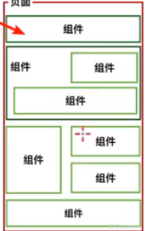

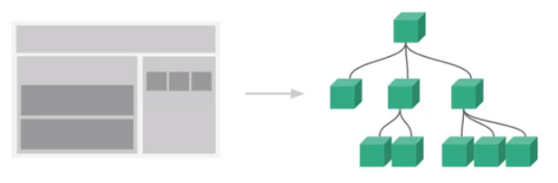


### 2、组件化步骤

* 创建组件构造器对象
* 注册组件
* 使用组件

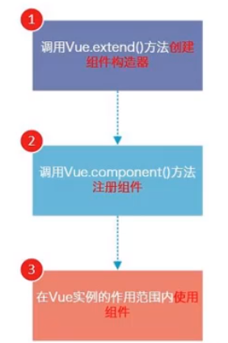


* 组件只能在==Vue实例范围==内使用


==实例展示：==

```html
<div id="app">
  <my-cpn></my-cpn>
  <my-cpn></my-cpn>
  <my-cpn></my-cpn>
  <my-cpn></my-cpn>
</div>

<script>

  //创建组件构造器
  const componentConstructor = Vue.extend({
    template: `
      <div>
        <h2>我是标题</h2>
        <p>我是内容,哈哈哈</p>
        <p>我是内容,嘿嘿嘿</p>
      </div>
    `
  });

  //注册组件(组件标签名, 构造器)
  Vue.component('my-cpn', componentConstructor);

  const app = new Vue({
    el: '#app',
    data: {
    }
  })
</script>
```


### 3、全局组件与局部组件

* 全局组件：在任意Vue实例中都可使用
  * 直接使用vue.js中的实例Vue来进行组件注册即可
* 局部组件：在指定的Vue实例中可以使用
  * 构造器可以写在vue.js的Vue实例中
  * 注册时在相对应的Vue实例中进行注册


==局部组件注册：==

```html
<div id="app">
  <!--此处会报错-->
  <cpn></cpn>
</div>

<div id="app2">
  <cpn></cpn>
  <cpn></cpn>
  <cpn></cpn>
</div>

<script>

  const cpnC = Vue.extend({
    template: `
      <div>
        <h2>这是个标题</h2>
        <p>这是内容,哈哈哈</p>
      </div>
    `
  });

  const app = new Vue({
    el: '#app',
    data: {}
  });

  const app2 = new Vue({
    el: '#app2',
    data: {},
    components: {
      // cpn：组件标签名
      // cpnC：构造器
      cpn: cpnC
    },
  });
</script>
```


### 4、父组件与子组件

```text
父组件中可以注册子组件，从而使子组件可以在父组件的complete作用域中生效
注意：
	子组件构造器要在父组件构造器之前
	在父组件的components属性中注册子组件
	若子组件为全局组件，则可以不需要在父组件中进行注册即可使用
```

```html
<div id="app">
  <cpn2></cpn2>
</div>

<script>
  <!--第一个组件构造器（子组件）-->
  const cpnC1 = Vue.extend({
    template:`
      <div>
        <h2>我是第一个组件</h2>
      </div>
    `
  });

  <!--第二个组件构造器（父组件）-->
  const cpnC2 = Vue.extend({
    template:`
      <div>
        <h2>我是第二个组件</h2>
        <cpn1></cpn1>
      </div>
    `,
    components: {
      cpn1: cpnC1,
    }
  });


  const app = new Vue({
    el: '#app',
    data: {
      message: 'hello Vue!'
    },
    components: {
      cpn2: cpnC2,
    }
  })
</script>
```


### 5、注册组件的语法糖

```html
<script>
  Vue.component('cpn1', {
    template: `
      <div>
        <h2>我是全局组件</h2>
      </div>
    `,
  })

  const app = new Vue({
    el: '#app',
    components: {
      cpn2: {
        template: `
          <div>
            <h2>我是局部组件</h2>
          </div>
        `
      }
    }
  })
</script>
```


### 6、分离模板template

```text
1、使用script标签，但注意类型为：text/x-template，且要标明id
```

```html
<script type="text/x-template" id="cpn1">
  <div>
    <h2>这是组件1</h2>
  </div>
</script>
<script>
    Vue.component('cpn1', {
      template: '#cpn1'
  	});
</script>
```

```text
2、使用template标签，标明id即可
```

```html
<template id="cpn2">
  <div>
    <h2>这是组件2</h2>
  </div>
</template>
```


### 7、组件中的数据存放

```text
由于组件不能使用 Vue实例 的data，因此组件拥有自己的 data函数
使用 data函数，要求函数返回一个对象类型
```

```html
<template id="cpn1">
  <h2>{{title}}</h2>
</template>

<script>
  Vue.component('cpn1', {
    template: '#cpn1',
    data() {
      return {
        title: '我是组件1'
      }
    }
  })
</script>
```


==为什么组件的data是一个函数，而不是对象？==

* 因为若data为一个对象，则在多次调用组件时，data返回的都是同一个对象，因此会**数据共享**
* 而data为一个函数，多次调用时，返回的都是一个新的对象，数据就不会共享


### 8、父子组件通信(父传子props)

```text
在实际开发过程中，页面请求服务器，拿到了数据data
而部分data不是在最外层的组件中展示，而是需要内部的子组件进行展示时，就需要实现从上到下的数据传递
那么如何进行父子组件的通信呢？
Vue官方推荐：
	1、使用props向子组件传递数据（父->子）
	2、通过事件向父组件发送信息（子->父）
```

==1、使用props==

* 在使用子组件时，需要绑定父子组件的数据

```html
<div id="app">
  <cpn :cheros="heros" :cmessage="message"></cpn>
</div>

<template id="cpn">
  <div>
    <p>{{cheros}}</p>
    <h2>{{cmessage}}</h2>
  </div>
</template>

<script>

  //组件对象
  const cpn = {
    template: '#cpn',
    data() {return {}},
    props: ['cheros', 'cmessage']
  };

  const app = new Vue({
    el: '#app',
    data: {
      message: 'hello Vue!',
      heros: ['海贼王', '海尔兄弟', '加百利']
    },
    components: {
      cpn
    }
  })
</script>
```

* ==props可以确定传递参数的类型==

```html
props: {
      cheros: Array,
      cmessage: String
    }
```

* ==props可以确定传递参数的一些参数==

```html
//可以指定传递参数的一些参数
    props: {
      cmessage: {
        type: String,
        default: 'aaaaa',  //默认值
        required: true,  //使用该组件时必须传递该参数cmessage
      },
      cheros: {
        type: [Array, Object],  //若参数可能为多种类型，可以使用数组的形式
        default() {  // 当参数类型为Object或Array时，默认值需为函数
          return ['苹果', '香蕉'];
        }
      }
    }
```

* ==props的驼峰写法==

```html
<div id="app">
  <cpn :c-info="info" :child-message="message"></cpn>
</div>

<script>
    const cpn = {
        template: '#cpn',
        props: {
          cInfo: {
            type: Object,
            default() {
              return {}
            }
          },
          childMessage: {
            type: String,
            default: 'aaa'
          }
        }
      };
</script>

```


### 9、父子组件通信（子传父）

```text
1、props用于父传子，而子传父则需要使用 自定义事件
2、子组件通过在methods中使用 this.$emit('事件名', 参数) 来发射自定义事件
3、父组件通过在调用子组件标签时，监听对应事件名来进行参数的获取
```

```html
<div id="app">
  <!--父组件监听子组件发射的事件-->
  <cpn @cpn_click="cpnClick"></cpn>
</div>

<!-- 子组件模板 -->
<template id="cpn">
  <div>
    <!--监听按钮点击事件，并向父组件发射自定义事件传输数据-->
    <button v-for="item in categories"
            @click="btnClick(item)">{{item.name}}</button>
  </div>
</template>

<script>
  // 子组件对象
  const cpn = {
    template: '#cpn',
    data() {
      return {
        categories: [
          {id: 'aaa', name: '热门推荐'},
          {id: 'bbb', name: '热门家电'},
          {id: 'ccc', name: '电脑游戏'},
        ]
      }
    },
    methods: {
      btnClick(item) {
        // 向父组件发射自定事件
        this.$emit('cpn_click', item);
      }
    }
  };

  const app = new Vue({
    el: '#app',
    data: {
      message: 'hello Vue!'
    },
    components: {
      cpn
    },
    methods: {
      // 监听到子组件事件后处理数据
      cpnClick(item) {
        console.log(item);
      }
    },
  })
</script>
```


### 10、父组件访问子组件$refs

```text
1、父组件可以通过调用 this.$refs.refName 来查看VueComponent组件对象
2、子组件在被调用时，需添加属性refName，父组件以此来识别
3、父组件访问子组件可以调用子组件的方法，获取子组件的属性
```

```html
<div id="app">
  <cpn></cpn>
  <cpn></cpn>
  <cpn ref="aaa"></cpn>
  <button @click="btnClick">按钮</button>
</div>

<template id="cpn">
  <div>
    <p>我是子组件</p>
  </div>
</template>

<script>
  const app = new Vue({
    el: '#app',
    data: {
    },
    components: {
      cpn: {
        template: '#cpn',
        data() {
          return {
            name: '子组件'
          }
        },
        methods: {
          getMessage() {
            console.log('我是子组件的方法');
          }
        }
      }
    },
    methods: {
      btnClick() {
        console.log(this.$refs.aaa.name);
        this.$refs.aaa.getMessage();
      }
    }
  })
</script>
```


### 11、插槽

#### 1、基础使用

```text
1、插槽时扩展子组件模板的一种的写法，由于子组件中有些部分需要由父组件来决定内容，因此可以使用插槽
2、插槽的使用：
	子组件中使用<slot>标签
	父组件中引用子组件时使用v-slot属性
	v-slot缩写：#
	在子组件标签中填写内容
3、插槽默认值：直接在<slot>标签中填写默认值，若父组件没有指定内容，则使用默认值
```

```html
<div id="app">
  <cpn v-slot:default>
    <p>我是父组件</p>
    <button>按钮</button>
  </cpn>
</div>

<template id="cpn">
  <div>
    <p>我是子组件</p>
    <slot><button>按钮</button></slot>
  </div>
</template>

<script>
  const app = new Vue({
    el: '#app',
    data: {
    },
    components: {
      cpn: {
        template: '#cpn',
      }
    }
  })
</script>
```


#### 2、具名插槽的使用：

```text
1、<slot>标签可以有属性name，以此来区分
2、父组件在添加插槽内容的时，在外包一层<template v-slot:name>,若slot没有name，则v-slot:default
3、若父组件没有指定内容slot属性，则插入的内容为没有name的slot标签
```

```html
<div id="app">
  <cpn>
    <template v-slot:left>
      <button >按钮</button>
    </template>
    <template v-slot:center>
      <a href="#">中间</a>
    </template>
    <template #default>
      <p>我是父组件</p>
    </template>

  </cpn>
</div>

<template id="cpn">
  <div>
    <slot name="left"><span>左边</span></slot>
    <slot name="center"><span>中间</span></slot>
    <slot name="right"><span>右边</span></slot>
    <slot></slot>
  </div>
</template>
```


#### 3、编译作用域

```text
1、组件中进行data数据绑定查询时，只会在当前组件下寻找，不会从子组件中取数据
2、如下列代码，pLanguages是子组件的数据，在父组件调用子组件时，是不能够获取到的
```

```html
<div id="app">
  <cpn>
    <template #center>
      <span>{{pLanguages}}</span>
    </template>
  </cpn>
</div>

<template id="cpn">
  <div>
    <slot name="center" :data="pLanguages">
      <ul>
        <li v-for="item in pLanguages">{{item}}</li>
      </ul>
    </slot>
  </div>
</template>

<script>
  const app = new Vue({
    el: '#app',
    data: {
    },
    components: {
      cpn: {
        template: '#cpn',
        data() {
          return {
            pLanguages: ['JavaScript', 'Java', 'C++', 'Python']
          }
        }
      }
    }
  })
</script>
```


#### 4、作用域插槽

```text
1、有时候，子组件展示数据的方式，并不是父组件想要的
2、这时候，父组件就希望能够拿到子组件的数据，从而从新展示
```

```html
<div id="app">
  <cpn></cpn>
  <cpn>
    <template #center="pLanguages">
      <!--通过pLanguages.data来获取数据-->
      <span>{{pLanguages.data.join(' - ')}}</span>
    </template>
  </cpn>
</div>

<template id="cpn">
  <div>
    <slot name="center" :data="pLanguages">
      <ul>
        <li v-for="item in pLanguages">{{item}}</li>
      </ul>
    </slot>
  </div>
</template>

<script>
  const app = new Vue({
    el: '#app',
    data: {
    },
    components: {
      cpn: {
        template: '#cpn',
        data() {
          return {
            pLanguages: ['JavaScript', 'Java', 'C++', 'Python']
          }
        }
      }
    }
  })
</script>
```


